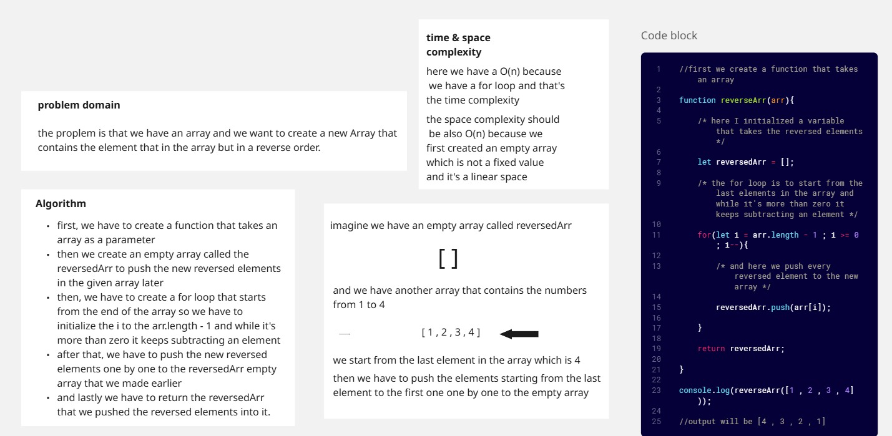
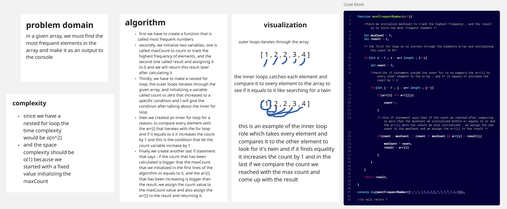
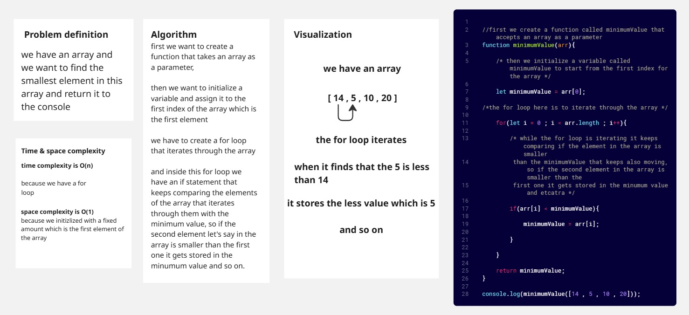
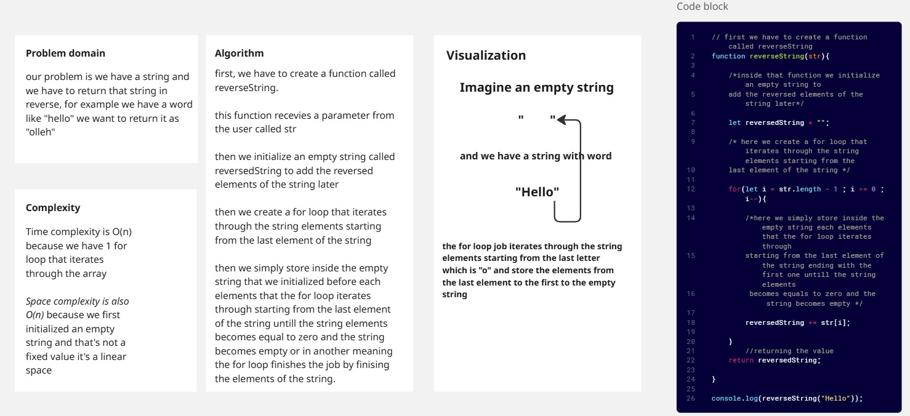
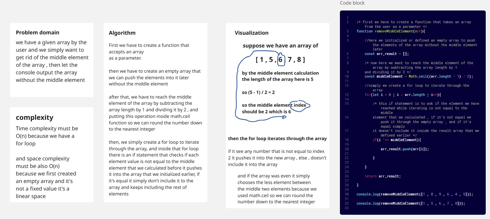

### Whiteboard Images

### Challenge A: the Array reversal

### Challenge B: the most frequent elements in the array 

### challenge 2: Minimum value in the Array

### challenge 3: Reverse Characters

Inside the reversed-Characters file we have a readme file that contains a screenshot of the output of the console or click on this link :

[go to the output screenshot](./Reverse-Characters/Readme.md)

[go to the console output](./Reverse-Characters/Programs.js)

### challenge 4: Remove Middle Element

[go to the code source](./removeMiddleElement/removeMiddlelement.js)

[go to the console output](./removeMiddleElement/readme.md)

### linkedList challenge :

[go to the whileboards and console screenshots outputs of the linkedList](./Data-Structures/readme.md)

### linkedlist reverse 

click on this link to se the white board of the linkedlist reverse challenge

[go to the whiteboard of the reverse linkedlist function and console output](./Data-Structures/LinkedList/Linked-List-Implementation/Reverse/readme.md)

### mergeLists challenge

[go the white board documentation and output and testing of the merge two lists challenge](./Data-Structures/LinkedList/Linked-List-Implementation/MergeSorted/readme.md)

### Linked list rotate by k

[go the the liked list rotation challenge](./Data-Structures/LinkedList/Linked-List-Implementation/RotateLinkedList/readme.md)

### stack and queue implementation challenge

[go to the stack and queue whiteboards and console output and testing](./Data-Structures/StackAndQueue/readme.md)

### Remove the middle element from the stack

[go to the white board documentation and implementation and testing](./Data-Structures/StackAndQueue/StackAndQueueImplementation/DeleteMiddleElement/readme.md)

### Minimum element in the stack challenge

[go to the whiteboard documentation and implementation and testing](./Data-Structures/StackAndQueue/StackAndQueueImplementation/MinStack/readme.md)

### Tree Implementation challenge

[go to the whiteboard documentation and implementation and testing](./Data-Structures/Trees/TreeImplementation/readme.md)